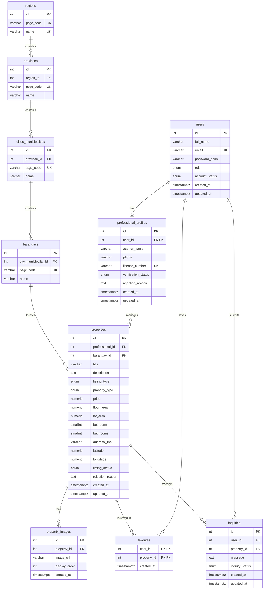

# Entity-Relationship Diagram

GitHub renders this diagram automatically.

```mermaid
erDiagram
    users ||--o| professional_profiles : "has"
    professional_profiles ||--o{ properties : "manages"
    regions ||--o{ provinces : "contains"
    provinces ||--o{ cities_municipalities : "contains"
    cities_municipalities ||--o{ barangays : "contains"
    barangays ||--o{ properties : "locates"
    properties ||--o{ property_images : "has"
    users ||--o{ favorites : "saves"
    properties ||--o{ favorites : "is saved in"
    users ||--o{ inquiries : "submits"
    properties ||--o{ inquiries : "receives"
    users {
        int id PK
        varchar full_name
        varchar email UK
        varchar password_hash
        enum role
        enum account_status
        timestamptz created_at
        timestamptz updated_at
    }
    professional_profiles {
        int id PK
        int user_id FK, UK
        varchar agency_name
        varchar phone
        varchar license_number UK
        enum verification_status
        text rejection_reason
        timestamptz created_at
        timestamptz updated_at
    }
    regions {
        int id PK
        varchar psgc_code UK
        varchar name UK
    }
    provinces {
        int id PK
        int region_id FK
        varchar psgc_code UK
        varchar name
    }
    cities_municipalities {
        int id PK
        int province_id FK
        varchar psgc_code UK
        varchar name
    }
    barangays {
        int id PK
        int city_municipality_id FK
        varchar psgc_code UK
        varchar name
    }
    properties {
        int id PK
        int professional_id FK
        int barangay_id FK
        varchar title
        text description
        enum listing_type
        enum property_type
        numeric price
        numeric floor_area
        numeric lot_area
        smallint bedrooms
        smallint bathrooms
        varchar address_line
        numeric latitude
        numeric longitude
        enum listing_status
        text rejection_reason
        timestamptz created_at
        timestamptz updated_at
    }
    property_images {
        int id PK
        int property_id FK
        varchar image_url
        int display_order
        timestamptz created_at
    }
    favorites {
        int user_id PK, FK
        int property_id PK, FK
        timestamptz created_at
    }
    inquiries {
        int id PK
        int user_id FK
        int property_id FK
        text message
        enum inquiry_status
        timestamptz created_at
        timestamptz updated_at
    }
```
